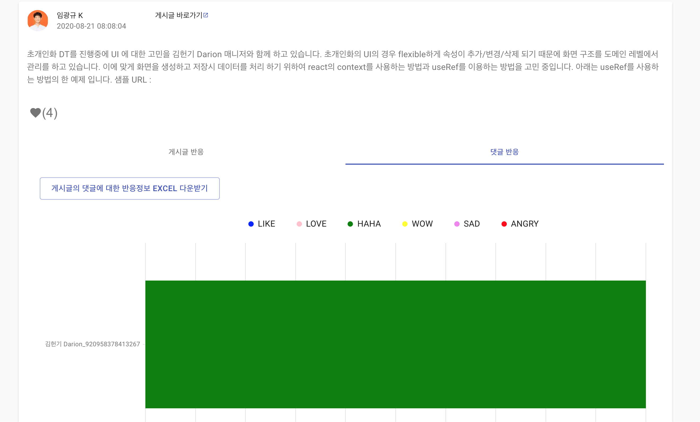

# [Workplace](https://work.workplace.com/) 게시물 반응 조회

> 워크플레이스의 관리자에서는 특정 게시물의 상세 반응 정보를 제공하지 안습니다.
때문에 이벤트성 게시물에 대한 반응정보를 요청받으면, GRAPH API를 이용해서 excel 형태로 제공했었습니다. 


> 워크플레이스에서 작성된 게시물에 대한 반응 정보에 대하여 아래 그림처럼 표기해줍니다.
반응 정보는 게시물의 반응 정보와 댓글에 대한 반응 정보로 나뉩니다.
모든 반응 정보는 excel 형식으로 다운로드가능합니다.

***Screen***

#### 게시물 정보 조회
- 게시물 ID를 입력하거나, 게시물의 주소를 넣으면 자동으로 게시물 ID로 변환합니다.


#### 게시물 반응 상세 조회


#### 게시물 댓글 정보 조회


#### 게시물 댓글 상세 조회


#### 추첨자 조회


## Table of Contents 

> 사용된 프로그램과 설정

- [Installation](#installation)
- [Workplace](#workplace)
- [Dockerfile](#dockerfile)
- [Version](#version)
- [License](#license)


---

## Installation

- 설치를 위해서는 기본적으로 NODEJS 12.x 이상의 버젼이 필요합니다.


### Backend

- [Oas 3.0](https://swagger.io/specification/) 기반으로 작성되었습니다.
- PATH : **wp_reaction_api**

> .env 설정은 _env 파일을 .env로 변경하여서 Key에 알맞은 값을 설정 하면 됩니다.
또는 아래 샘플을 이용하셔요.
ANALYTICS_ACCESS_KEY는 workplace 관리자 화면에서 생성한 맞춤 통합의 토큰 값입니다
해당 통합은 게시물, 댓글 사용자의 정보를 조회하는 권한을 주어야 합니다.
cors 설정이 필요할 경우(BACKEND/FRONTEND가 다른 경우) ```ORIGIN_URL```에 FRONTEND 서버 주소를 넣어주세요.

```
NODE_ENV=deploment
SERVER_PORT=10010
ANALYTICS_ACCESS_KEY=
WP_API_HOST=https://graph.facebook.com
ORIGIN_URL=
```

> 실행

```
$ npm run start
```

서버가 문제 없이 기동이 되면 [Swagger UI](http://localhost:10010/docs)을 확인하세요.

### Frontend

- [ReactJS](https://reactjs.org/)로 작성되어 있습니다.
- PATH : **wp_reaction_frontend**

> .env 설정은 _env 파일을 .env로 변경하여서 Key에 알맞은 값을 설정 하면 됩니다.
또는 아래 샘플을 이용하셔요.

```
REACT_APP_API=http://localhost:10010/api # API SERVER 주소
REACT_APP_WP_URL=https://{domain}.workplace.com # workplace 주소
```

> 실행 

```
$ npm install
# npm run start
```

## [Workplace](https://work.workplace.com/) 

> [Workplace](https://work.workplace.com/)은 페이스북에서 개발한 엔터프라이즈 연결 플랫폼입니다. 
그룹 사용, 인스턴스 메시징 및 뉴스 피드를 포함합니다.

게시물의 반응을 확인하기 위해서 관리자 페이지에서 맞춤 통합을 생성해야 합니다.


통합 생성후 다음 3개의 통합 권한(그룹 콘텐츠 읽기, 사용자 이메일 읽기, 그룹 멤버 읽기)을 할당해야 합니다.


---

## Dockerfile

- docker image 생성 파일 제공
- Dockerfile 참조

> 이미지 생성

```
# docker build -t ${image-name}:${version} .

$ docker build -t wp-reaction:1.0 .
```

> 이미지 실행 

```
# docker run -p 8888:80 --rm ${image-name}:${version}

$ docker run -p 8888:80 --rm wp-reaction:1.0
```

[Dockerfile 더 자세히 알아보기](https://lahuman.github.io/reactjs-dockerfile/)

---

## Version

- v1.3 : 읽은 사람 목록 받기 기능 추가
    + 읽은 사람 목록 받기 기능 추가
    + 버그 수정
    
- v1.2 : 추첨 기능 추가
    + 반응 / 댓글 기준으로 추첨 
    + 댓글 차트에서 이름 라벨 클릭시 상세 보기 

- v1.1 : 게시글과 댓글 통합해서 보기
    + 게시글에 첨부된 반응 함께 보기 기능 추가
    + 댓글의 댓글 누락 수정

- v1.0 : workplace 게시물 반응 정보 조회

---

## License

[](http://badges.mit-license.org)

- **[MIT license](http://opensource.org/licenses/mit-license.php)**
- Copyright 2020 © <a href="https://lahuman.github.io" target="_blank">lahuman</a>.
